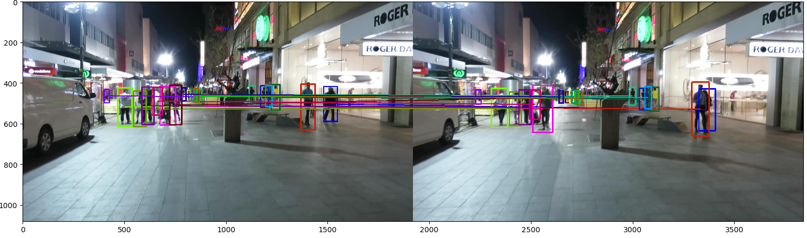

#  A Library of Multi-Object Tracking in Python and Pytorch

## Installation

environments: python 3.6.10, opencv 4.1.1, pytorch 1.3+

```bash
git clone https://github.com/nightmaredimple/libmot --recursive
cd libmot/
python setup.py install develop --user
```

The details can be seen from my [blogs](https://huangpiao.tech/) or [zhihu](https://www.zhihu.com/people/huang-piao-72/posts).

## Feature Lists

|          Block          |               Method                |       Reference        | Complete |
| :---------------------: | :---------------------------------: | :--------------------: | :------: |
|                         |           IOU Assignment            |   iou-tracker&V-IOU    |    ✓     |
|                         |          Linear Assignment          |           -            |    ✓     |
|  **Data Association**   |             MinCostFlow             |          MCF           |    ✓     |
|                         |      Other End-to-End Network       |      DAN&DeepMOT       |    ☐     |
|                         |               GNN&GCN               |        MPNTrack        |    ☐     |
| ----------------------- | ----------------------------------- | ---------------------- |   ---    |
|                         |            Kalman Filter            |     Sort&DeepSort      |    ✓     |
|       **Motion**        |                 ECC                 |       Tracktor++       |    ✓     |
|                         |          Epipolar Geometry          |          TNT           |    ✓     |
| ----------------------- | ----------------------------------- | ---------------------- |   ---    |
|                         |                Re-ID                |           -            |    ☐     |
|     **Appearance**      |      Feature Fusion&Selection       |           -            |    ☐     |
|                         |                 DAN                 |          DAN           |    ✓     |
| ----------------------- | ----------------------------------- | ---------------------- |   ---    |
|      **Detection**      |          Faster RCNN + FPN          |       Tracktor++       |    ☐     |
| ----------------------- | ----------------------------------- | ---------------------- |   ---    |
|         **SOT**         |               CF&Siam               |         KCF&CN         |    ☐     |
| ----------------------- | ----------------------------------- | ---------------------- |   ---    |
|                         |             DataLoader              |           -            |    ✓     |
|       **Tricks**        |          Spatial Blocking           |           -            |    ✓     |
| ----------------------- | ----------------------------------- | ---------------------- |   ---    |
|                         |             Evaluation              |           -            |    ✓     |
|       **Others**        |        Tracking Visualiztion        |           -            |    ✓     |
|                         |        Feature Visualiztion         |           -            |    ☐     |
| ----------------------- | ----------------------------------- | ---------------------- |   ---    |
|      **Tracktor**       |             MIFT(ours)              |           -            |    ☐     |
| ----------------------- | ----------------------------------- | ---------------------- |   ---    |
|      **Detector**       |             MIFD(ours)              |           -            |    ☐     |


## Motion Model

```python
python scripts/test_kalman_tracker.py
```

 <div align="center">
  
 </div>

## Data Association

 <div align="center">
  
 </div>

## Tracktor

Our proposed MIFT and MIFD will be released upon acceptance.

In MOT Challenge, the MIFT tracktor is named as ISE-MOT, the MIFD detector is named as ISE-MOTDet.

|  Method  | DataSets | MOTA↑ | IDF1↑ |  MT↑  |  ML↓  |  FP↓  |  FN↓   | ID Sw.↓ | Frag↓ | Hz↑  |
| :------: | :------: | :---: | :---: | :---: | :---: | :---: | :----: | :-----: | :---: | :--: |
|          |  MOT15   | 48.1  | 52.1  | 29.5% | 26.2% | 10246 | 20840  |   776   | 1197  | 6.7  |
| **MIFT** |  MOT16   | 60.4  | 57.3  | 24.6% | 28.9% | 5510  | 66723  |   704   |  932  | 6.9  |
|          |  MOT17   | 60.1  | 56.2  | 28.1% | 27.8% | 22265 | 200077 |  2644   | 3206  | 7.2  |

|  Method  | DataSets | AP↑  | MODA↑ | FAF↓ | Precision↑ | Recall↑ |
| :------: | :------: | :--: | :---: | :--: | :--------: | :-----: |
| **MIFD** | MOT17Det | 0.88 | 70.7  | 4.1  |    81.4    |  91.7   |

To be continued..